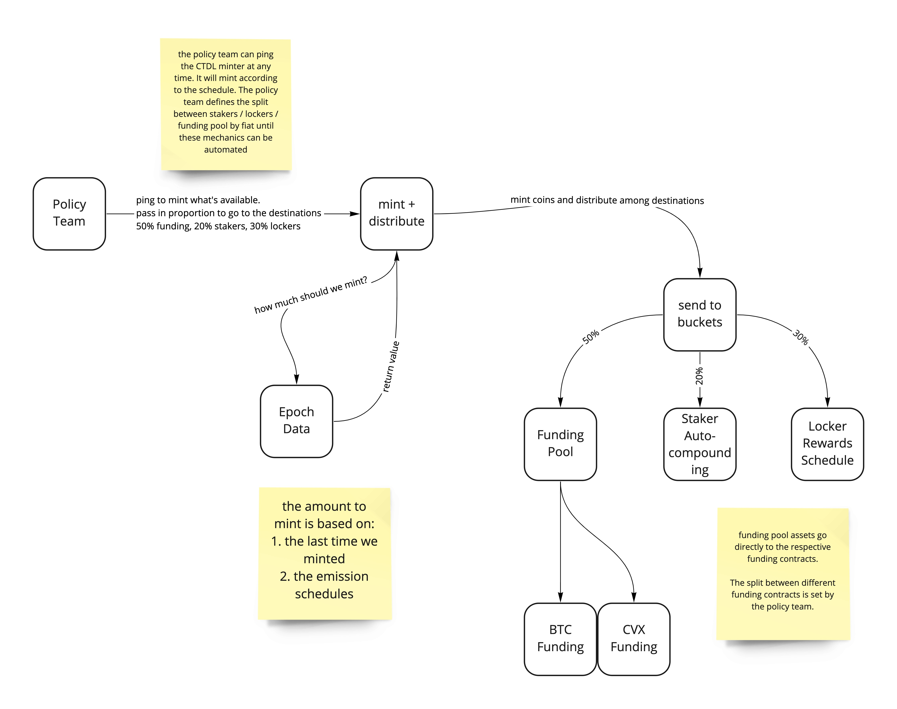

# Emissions
The policy operations entity can ping the minter to mint new citadel, based on the logic in the SupplySchedule contract. Each mint factors in in the last mint time and the supply schedule to determine how many citadel to mint.

The supply schedule contains an approximation of the supply schedule function which is outlined in the [tokenomics article](https://thecitadeldao.medium.com/tokenomics-deep-dive-a11e7f5e2083).

These new tokens are then divided between three destinations, based on the treasury vs market cap logic (which is handled off-chain in a trusted manner until a contract can be written).

Destinations:
* Stakers
* Lockers
* Funding

The amount of citadel going to Funding is further distributed between the various funding pool contracts according to weights which are managed by the policy ops entity. There is a unique funding pool contract for each asset the DAO is interested in (wBTC, CVX, etc).

